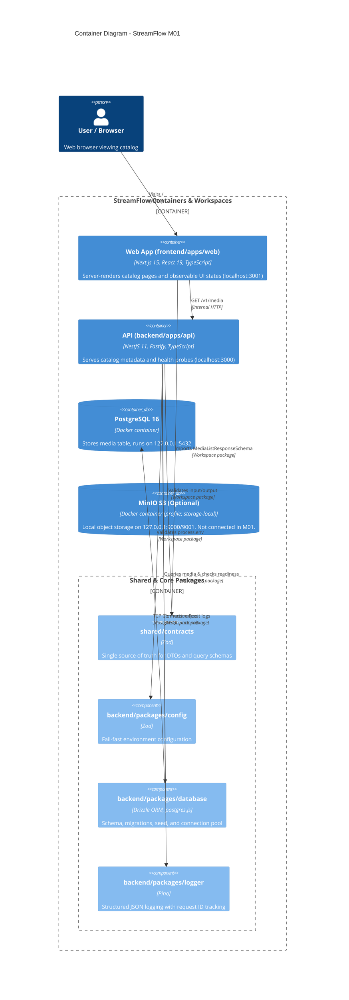

# StreamFlow — Container Diagram (M01 Foundation)

```mermaid
C4Container
  title Container Diagram - StreamFlow M01

  Person(user, "User / Browser", "Web browser viewing catalog")

  Container_Boundary(c0, "StreamFlow Containers & Workspaces") {
    Container(web_app, "Web App (frontend/apps/web)", "Next.js 15, React 19, TypeScript", "Server-renders catalog pages and observable UI states (localhost:3001)")
    Container(api_app, "API (backend/apps/api)", "NestJS 11, Fastify, TypeScript", "Serves catalog metadata and health probes (localhost:3000)")

    Container_Boundary(pkgs, "Shared & Core Packages") {
      Component(contracts, "shared/contracts", "Zod", "Single source of truth for DTOs and query schemas")
      Component(config, "backend/packages/config", "Zod", "Fail-fast environment configuration")
      Component(database_pkg, "backend/packages/database", "Drizzle ORM, postgres.js", "Schema, migrations, seed, and connection pool")
      Component(logger, "backend/packages/logger", "Pino", "Structured JSON logging with request ID tracking")
    }

    ContainerDb(postgres, "PostgreSQL 16", "Docker container", "Stores media table, runs on 127.0.0.1:5432")
    ContainerDb(minio, "MinIO S3 (Optional)", "Docker container (profile: storage-local)", "Local object storage on 127.0.0.1:9000/9001. Not connected in M01.")
  }

  Rel(user, web_app, "Visits /", "HTTP")
  Rel(web_app, api_app, "GET /v1/media", "Internal HTTP")
  Rel(web_app, contracts, "Imports MediaListResponseSchema", "Workspace package")
  Rel(api_app, contracts, "Validates input/output", "Workspace package")
  Rel(api_app, config, "Validates process.env", "Workspace package")
  Rel(api_app, logger, "Formats request logs", "Workspace package")
  Rel(api_app, database_pkg, "Queries media & checks readiness", "Workspace package")
  Rel(database_pkg, postgres, "TCP Connection Pool", "PostgreSQL protocol")
```
